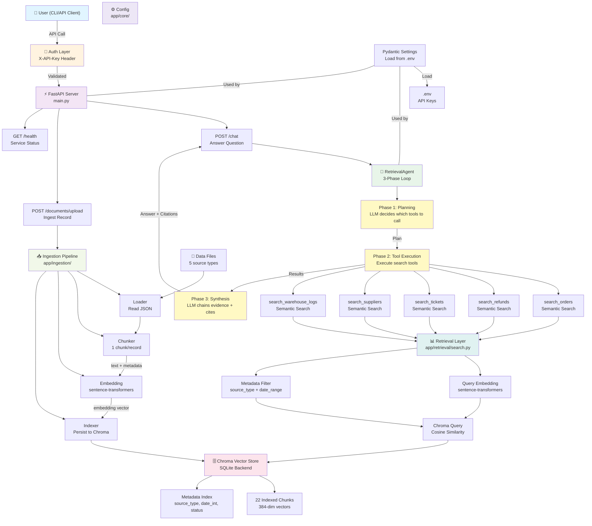
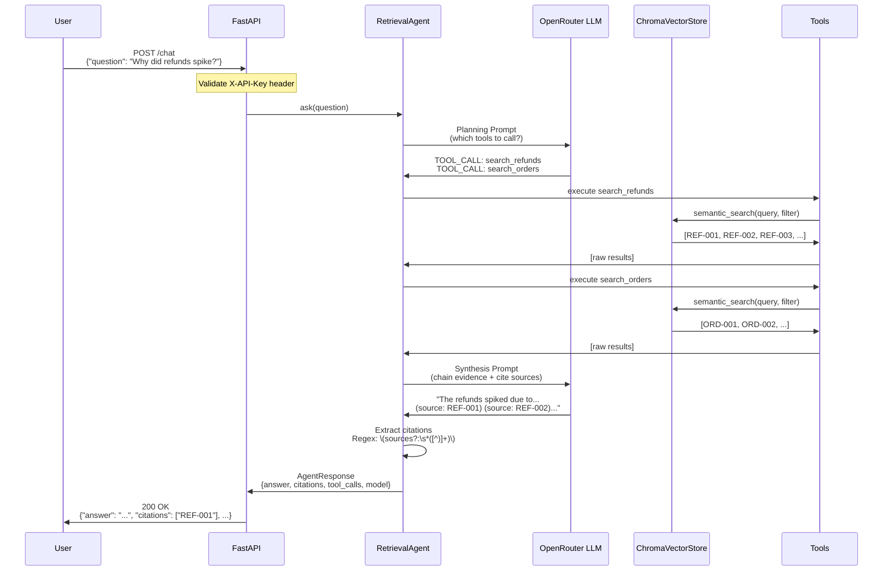
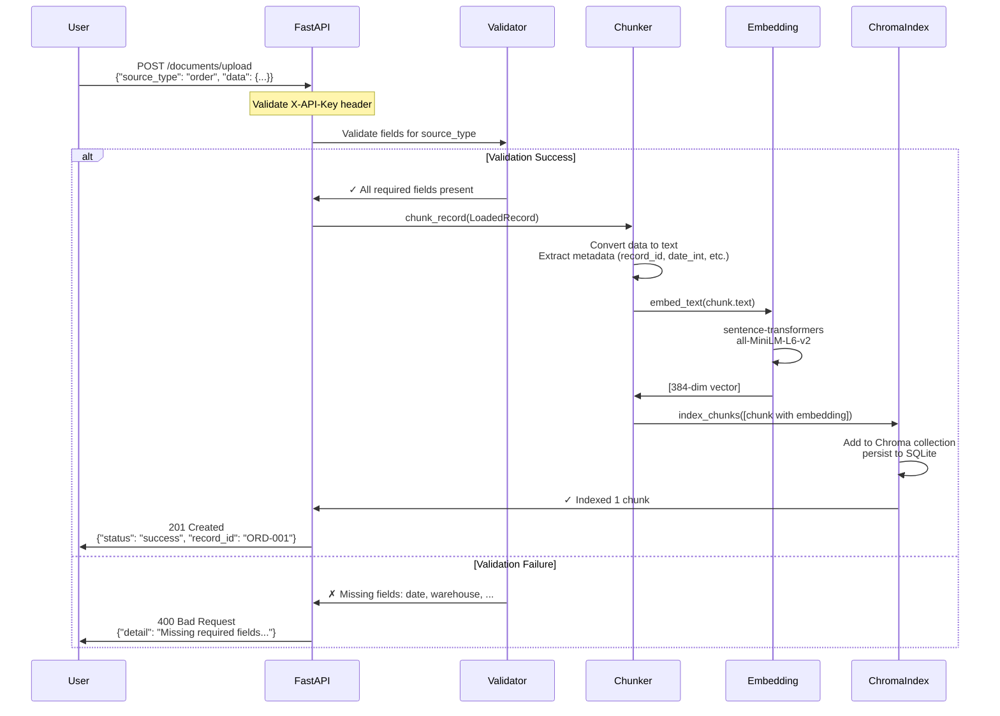

# Architecture Diagram — NovaCart Intelligence Layer (Phase 6)

## System Overview



---

## Request/Response Flow

### POST /chat (Answer Question)



### POST /documents/upload (Ingest Record)



---

## Component Details

### 1. FastAPI Layer (main.py)

**Endpoints:**
- `GET /health` — No auth, returns `{"status": "ok"}`
- `POST /chat` — Requires X-API-Key, accepts `{"question": "..."}`, returns answer + citations
- `POST /documents/upload` — Requires X-API-Key, accepts document record, ingests to Chroma
- `GET /docs` — Auto-generated Swagger UI

**Error Handling:**
- 401 Unauthorized → Missing X-API-Key header
- 403 Forbidden → Invalid X-API-Key value
- 400 Bad Request → Malformed document (missing required fields)
- 500 Internal Server Error → Embedding/indexing failure
- 502 Bad Gateway → LLM provider unavailable
- 503 Service Unavailable → LLM rate limited or API key not configured

### 2. RetrievalAgent (agent.py)

**Three-Phase Loop:**

1. **Phase 1: Planning**
   - Prompt: "Which tools to call for this question?"
   - LLM output: TOOL_CALL directives (search_orders, search_refunds, etc.)
   - Extracted via regex: `TOOL_CALL: {...json...}`

2. **Phase 2: Tool Execution**
   - Execute each tool call sequentially
   - Tool returns formatted results: `RECORD_ID | SOURCE_TYPE | DATE | DISTANCE | TEXT`
   - Accumulate all results

3. **Phase 3: Synthesis**
   - Prompt: "Chain evidence + cite sources"
   - LLM output: Final answer with (source: X) markers inline
   - Citation extraction via regex: `\(sources?:\s*([^)]+)\)`
   - Return: {answer, citations[], tool_calls[], model_used}

**Model Fallback:**
- Primary: `meta-llama/llama-3.3-70b-instruct`
- Fallback: `deepseek/deepseek-chat`
- If primary rate-limits, automatically retry with secondary model

### 3. Retrieval Layer (search.py)

**semantic_search(query, collection_name, n_results, source_types, date_range):**

1. **Embed query** using local sentence-transformers
2. **Build metadata filter** from source_types + date_range
   - source_type: `{"source_type": "refund"}` or `{"$or": [...]}`
   - date_range: `{"$and": [{"date_int": {"$gte": 20240101}}, ...]}`
3. **Query Chroma** with cosine similarity + where clause
4. **Format results** with record_id, source_type, document text, distance, metadata

**Result Format:**
```python
{
    "id": "REF-001",
    "record_id": "REF-001",
    "source_type": "refund",
    "document": "Refund REF-001 for order ORD-001...",
    "distance": 0.523,  # Cosine similarity (lower = more relevant)
    "metadata": {
        "date": "2024-01-22",
        "date_int": 20240122,
        "customer_id": "CUST-A123",
        "status": "processed",
        ...
    }
}
```

### 4. Chroma Vector Store

**Collection:** `novacart_docs`
- **Vectors:** 22 chunks × 384 dimensions (local embeddings)
- **Documents:** Full chunk text
- **Metadata:** source_type, record_id, date, date_int, status, customer_id, + type-specific fields
- **Storage:** SQLite at `./chroma_data/`

**Filtering Support:**
- Metadata $and, $or, $gte, $lte operators
- date_int field indexed for fast range queries (20240101–20240131)

### 5. Ingestion Pipeline

**End-to-End:** Load → Chunk → Embed → Index

```
app/ingestion/
├── loader.py        Reads 5 JSON files, yields LoadedRecord(data, source_type)
├── chunker.py       Converts record → text (readable format) + metadata
├── embedding.py     Embeds text using sentence-transformers (local, cached)
├── index.py         Indexes chunks into Chroma with metadata
└── pipeline.py      Orchestrates full pipeline (load 22 records, chunk, embed, index)
```

**Metadata Extraction (per source_type):**
- All types: record_id, date, source_type, status, category
- Order: warehouse, customer_id
- Refund: order_id, reason, customer_id, policy_version
- Ticket: category, priority, customer_id
- Supplier: supplier_name, product_sku, batch_id, defect_rate
- Warehouse: warehouse_id, order_id, event_type

### 6. Configuration (config.py)

**Pydantic BaseSettings:**
- Loads environment variables from `.env` file
- Supports case-insensitive field names
- Fields: `api_key`, `openrouter_api_key`, `chroma_persist_directory`, `debug`

**Usage:**
```python
from app.core.config import get_settings
settings = get_settings()
api_key = settings.openrouter_api_key  # From .env or environment
```

---

## Data Flow: Question → Answer

```
User Question
    ↓
1. Pydantic validation (question not empty)
    ↓
2. RetrievalAgent.ask() entry point
    ↓
3. Phase 1: Planning LLM prompt
   "Which tools to call?" → TOOL_CALL directives
    ↓
4. Phase 2: Execute tools (search_orders, search_refunds, etc.)
   For each tool:
   a) Execute tool with query + filters
   b) Chroma: embed query → cosine similarity → return top-5 results
   c) Format results as text
    ↓
5. Phase 3: Synthesis LLM prompt
   "Chain evidence + cite sources" → Answer with (source: X) markers
    ↓
6. Citation extraction
   Regex: \(sources?:\s*([^)]+)\) → List of record IDs
    ↓
7. Return AgentResponse
   {answer, citations[], tool_calls[], model_used}
    ↓
8. FastAPI serializes to JSON
    ↓
User sees answer + citations
```

---

## Deployment Topology

### Development (Local)

```
Laptop (macOS/Linux/Windows)
├── Python 3.14
├── FastAPI uvicorn (port 8000)
├── Chroma SQLite (./chroma_data/)
├── sentence-transformers cache (~80MB)
└── .env (API keys)
```

### Docker (Production-Ready)

```
Docker Host
└── docker-compose up
    ├── novacart_api (Port 8000)
    │   ├── Python 3.14
    │   ├── FastAPI + uvicorn
    │   ├── /app (code mounted)
    │   └── /data (chroma_data mounted)
    ├── Volume: chroma_data (Persists between restarts)
    └── Network: novacart-net
```

**docker-compose.yml:**
```yaml
version: '3.8'
services:
  api:
    build: .
    ports:
      - "8000:8000"
    environment:
      - OPENROUTER_API_KEY=${OPENROUTER_API_KEY}
      - API_KEY=${API_KEY}
      - CHROMA_PERSIST_DIRECTORY=/data/chroma_data
    volumes:
      - ./data:/app/data
      - chroma_data:/data/chroma_data
    command: python -m uvicorn app.main:app --host 0.0.0.0 --port 8000

volumes:
  chroma_data:
```

---

## Testing Architecture

```mermaid
graph TB
    Tests["pytest tests/"]
    
    APITests["test_api.py<br/>13 tests"]
    APITests --> HealthCheck["GET /health<br/>200 no auth"]
    APITests --> ChatAuth["POST /chat<br/>Auth tests"]
    APITests --> ChatErrors["POST /chat<br/>Error handling"]
    APITests --> UploadValidation["POST /upload<br/>Field validation"]
    
    AgentTests["test_agent.py<br/>12 tests"]
    AgentTests --> CitationExtract["Citation regex<br/>source: X parsing"]
    AgentTests --> PromptGen["Prompt generation<br/>Planning + Synthesis"]
    
    IngestionTests["test_chunker.py<br/>5 tests"]
    IngestionTests --> ChunkCount["1 chunk/record<br/>verified on 22"]
    IngestionTests --> Metadata["Metadata schema<br/>consistent"]
    
    RetrievelTests["test_retrieval.py<br/>8 tests"]
    RetrievelTests --> SourceFilter["Filter by<br/>source_type"]
    RetrievelTests --> DateFilter["Filter by<br/>date_range"]
    
    ValidationTests["test_validation.py<br/>8 tests"]
    ValidationTests --> OrderValidation["Order fields<br/>required"]
    ValidationTests --> RefundValidation["Refund fields<br/>required"]
    
    AllTests["46 tests<br/>All pass ✓"]
    
    APITests --> AllTests
    AgentTests --> AllTests
    IngestionTests --> AllTests
    RetrievelTests --> AllTests
    ValidationTests --> AllTests
```



---

**Diagram Version:** 1.0 (Phase 6 Final)  
**Last Updated:** 2026-07-29
